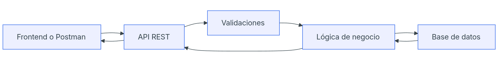

# Proyecto: UserManager API

UserManager API es una API REST para gestionar usuarios de una aplicación. Permitirá registrar usuarios, iniciar sesión, consultar perfiles, modificar datos, gestionar roles y proteger rutas privadas mediante autenticación.

---

## Recursos Generales

| Recurso | Explicación |
| :--- | :--- |
| `/auth` | Servirá para registrar usuarios e iniciar sesión. |
| `/users` | Servirá para consultar, crear, modificar y eliminar usuarios. |
| `/health` | Servirá para comprobar que la API está funcionando. |

---

## Modelo de Datos (Campos)

| Campo | Explicación |
| :--- | :--- |
| `id` | Identificador único del usuario. |
| `name` | Nombre completo del usuario. |
| `email` | Correo electrónico del usuario. |
| `passwordHash` | Contraseña cifrada. |
| `role` | Rol del usuario, `USER` o `ADMIN`. |
| `isActive` | Indica si el usuario está activo o desactivado. |
| `createdAt` | Fecha de creación. |
| `updatedAt` | Fecha de última modificación. |

---

## Endpoints (Rutas)

| Método | Ruta | Descripción | Acceso |
| :--- | :--- | :--- | :--- |
| **GET** | `/api/health` | Comprueba si la API funciona. | Público |
| **POST** | `/api/auth/register` | Registra un usuario. | Público |
| **POST** | `/api/auth/login` | Inicia sesión. | Público |
| **GET** | `/api/users/me` | Consulta mi perfil. | Usuario autenticado |
| **GET** | `/api/users` | Lista todos los usuarios. | ADMIN |
| **GET** | `/api/users/:id` | Consulta un usuario por ID. | ADMIN o propio usuario |
| **PATCH** | `/api/users/:id` | Modifica un usuario. | ADMIN o propio usuario |
| **DELETE** | `/api/users/:id` | Elimina o desactiva un usuario. | ADMIN |
| **PATCH** | `/api/users/me/password` | Cambia mi contraseña. | Usuario autenticado |
| **PATCH** | `/api/users/:id/role` | Cambia el rol de un usuario. | ADMIN |
| **PATCH** | `/api/users/:id/status` | Activa o desactiva un usuario. | ADMIN |

---

## Esquema de la API


El cliente envía una petición a la API. La API valida los datos, aplica la lógica necesaria, consulta o modifica la base de datos y devuelve una respuesta.

---

## Reglas Iniciales

* El email no se puede repetir.
* La contraseña no se guarda en texto plano.
* La API **nunca** devuelve el `passwordHash`.
* Un `USER` solo puede acceder a su propia información.
* Un `ADMIN` puede gestionar usuarios.
* Un usuario inactivo no puede iniciar sesión.
* La contraseña debe tener al menos 8 caracteres y debe incluir al menos una letra, un número y un carácter especial.
* El nombre del usuario no puede estar vacío.
* Un usuario no puede cambiar su propio rol.
* El email debe tener un formato válido.
* Límite de intentos fallidos (máximo 3)

---

## Posibles Errores

* **409 Conflict:** Al intentar registrar un email ya existente.
* **404 Not Found:** Al intentar consultar un usuario que no existe.
* **400 Bad Request:** Al enviar datos que no cumplen con las reglas de validación.
* **404 Forbidden:** Al intentar realizar una acción sin permisos suficientes.
* **401 Unauthorized:** Al intentar acceder a una ruta protegida.

---

## Diseño de Respuesta Inicial

Ejemplo de respuesta exitosa para el endpoint **`GET /api/users/me`**:

```json
{
  "id": 1,
  "name": "Ana García",
  "email": "ana@email.com",
  "role": "USER",
  "isActive": true
}
```


## ¿Qué es una API?

Una API es un **intermediario** que permite que el cliente se comunique con la base de datos mediante protocolos http sin acceder directamente a la misma. 